<p align="center">
  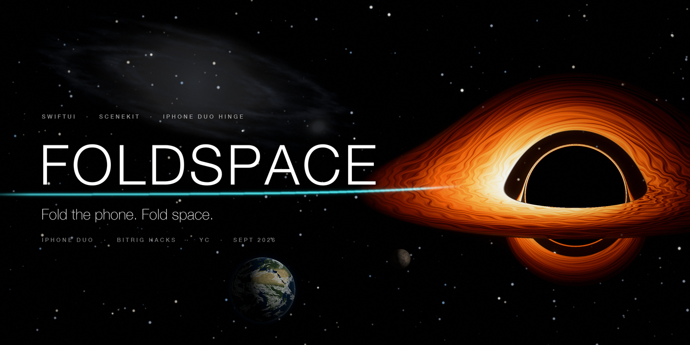
</p>

<h1 align="center">FOLDSPACE</h1>

<p align="center"><strong>Fold the phone. Fold space.</strong></p>

<p align="center">
A space-exploration game where the iPhone Duo's hinge <em>is</em> the ship.<br>
Close the phone and you fold space to the next star. Squeeze it, snap it open, and a planet shatters in the crease.
</p>

<p align="center">
  
  
  
  <a href="LICENSE"></a>
  
  <a href="https://github.com/vnmoorthy/foldspace/actions/workflows/build.yml"></a>
  <a href="https://github.com/vnmoorthy/foldspace"></a>
</p>

<p align="center">
  <a href="https://vnmoorthy.github.io/foldspace/"><strong>Landing page</strong></a> ·
  <a href="#quick-start">Quick start</a> ·
  <a href="#the-hinge-is-the-ship">Controls</a> ·
  <a href="#architecture">Architecture</a> ·
  <a href="docs/FOLDSPACE-Deck.pdf">Pitch deck (PDF)</a> · <a href="#deck--talk">Deck &amp; talk</a> ·
  <a href="#faq">FAQ</a>
</p>

<p align="center"><sub>Built in one day at <a href="https://events.ycombinator.com/bitrig-hacks-september2026">Bitrig Hacks: iPhone Duo Edition</a> · Y Combinator · 26 September 2026</sub></p>

---

### Why this only works on a folding phone

- **A flat iPhone has no angle.** There is nothing to close, squeeze, snap or pump. FOLDSPACE reads the hinge as a continuous joystick axis, with velocity and rhythm.
- **A flat iPhone has one plane.** Two screens meeting at a known angle are a 3D corner, like Seoul's wave billboard. The planet hologram stands *in the fold*.
- **A flat iPhone has one face.** When the phone is closed the outer display tells the world `FOLDING SPACE · 4.24 ly` while the ship is in transit.

<p align="center">
  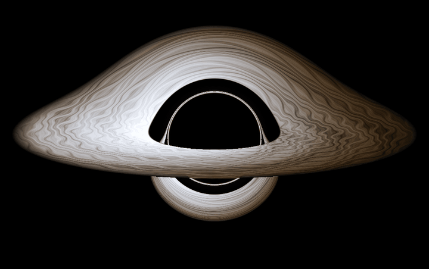
</p>
<p align="center"><sub><strong>Sagittarius A*</strong>, ray-traced along Schwarzschild null geodesics (RK4). The far side of the disc is bent over and under the shadow; the photon ring sits on the 2.598 r<sub>s</sub> critical curve. Seamless loop from the 360-frame render that ships in the app as HEVC-with-alpha.</sub></p>

---

## The hinge is the ship

Every hinge **posture** is a flight state. Every hinge **motion** is a verb. No mode switch, no button.

| | Posture | Angle | What you see | What it means |
|:-:|---|---|---|---|
| ▁ | **Closed** | 0–12° | Outer 5.4" display | Docked, or **in transit** (`FOLDING SPACE · 4.24 ly`) |
| ◢ | **Squeezed** | 12–45° | The crease glows | **Nova Lance charging** |
| ⌐ | **Cockpit** | 45–135° | Windshield above the fold, console below | Flying. The planet **hologram sits in the fold** |
| ⟋ | **Open** | 135–170° | Wide cockpit | Flying |
| ━ | **Flat** | 170–180° | The whole 7.6" inner display | **Galaxy map** |

| Gesture | Detected as | Game verb |
|---|---|---|
| Dip the lid and bring it back | `.hop` | **Hop** to the next planet in the system |
| Close the phone smoothly (60–160°/s) | `.warpClose(quality:)` | **Warp**: fold space to the targeted star. Slam it or crawl and the bubble collapses |
| Squeeze below 45° and hold | `.squeezeBegan` | **Charge** the Nova Lance |
| Snap it open (> 250°/s) | `.snapOpen` | **Fire**. The planet shatters in 3D in the corner |
| Pump open/shut four times, then slam | `.pump(count:)` → `.pumpComplete` | **Charge the Fold Core** for the 2.5-million-light-year jump |
| Close slowly while orbiting the Sun | continuous angle | **Dive**: depth = fold amount. Open the phone to climb out |
| Lay it flat | `.laidFlat` | **Galaxy map** |

The recogniser is [`HingeEngine.swift`](Foldspace/Hinge/HingeEngine.swift): a 2.5-second ring of `(angle, velocity, t)` samples turned into discrete gestures with hysteresis, so a squeeze never reads as a warp and a hop never reads as a close. Exact thresholds are in the [gesture reference](#gesture-recogniser-reference).

### The hologram in the fold

Corner billboards draw one scene across two surfaces that meet at an angle. iPhone Duo is exactly that, and it **knows its own angle**. [`SpaceScene`](Foldspace/Scene/SpaceScene.swift) pitches the SceneKit camera rig from the live hinge angle, so the planet stands on the console half and rises into the windshield half. Open or close the phone and the planet stays put while the screens move around it. The only control allowed to cross the fold is the probe: drag it up into the planet to plant a beacon.

---

## See it

Every image below was rendered in Blender 5.2 from equations and procedural shaders: no photographs, no downloaded reference imagery. Method, assumptions and timings are in [`assets/NOTES.md`](assets/NOTES.md).

<p align="center">
  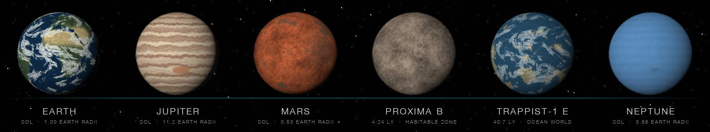
</p>
<p align="center"><sub>Six of 26 procedural 2048 × 1024 equirectangular worlds. Zonal bands and the Great Red Spot on the giants, craters and ice on rocky worlds. Atmosphere rims and lighting are added at runtime.</sub></p>

<table>
  <tr>
    <td width="50%">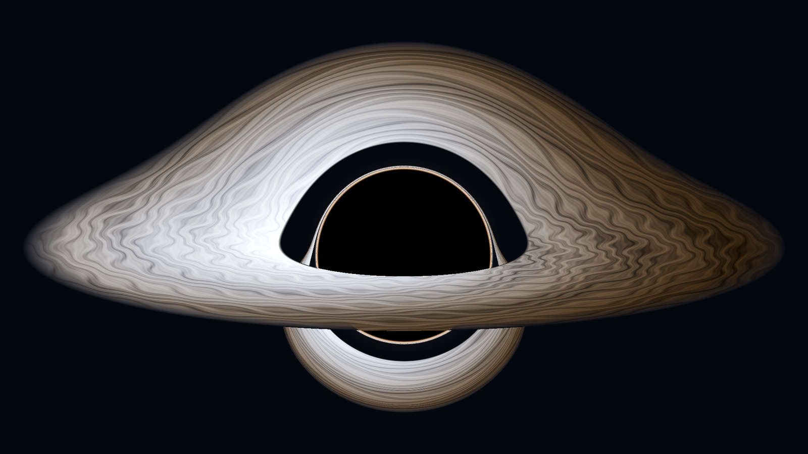</td>
    <td width="50%">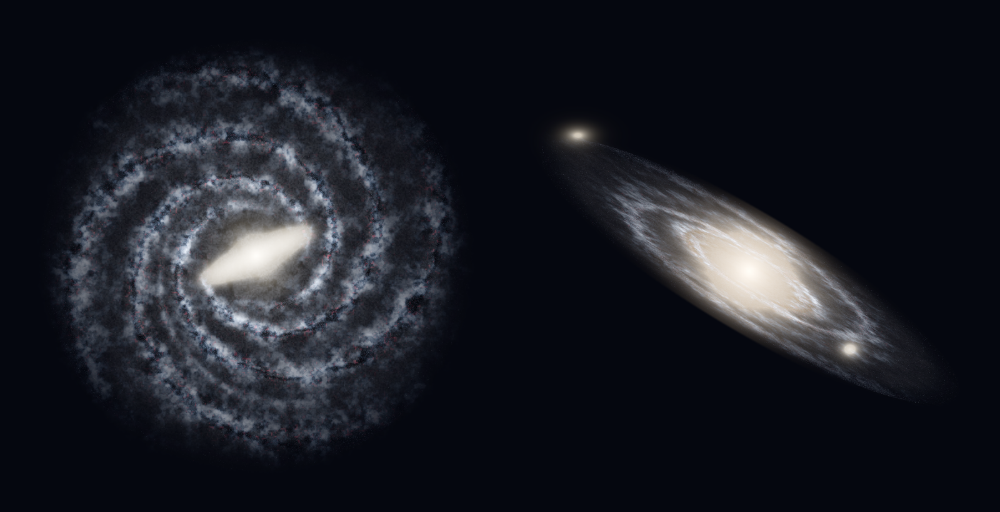</td>
  </tr>
  <tr>
    <td><sub><strong>Sagittarius A*.</strong> Doppler beaming (g⁴) brightens the approaching side; ISCO at 3 r<sub>s</sub>, 78° inclination, after Luminet 1979.</sub></td>
    <td><sub><strong>Milky Way · Andromeda.</strong> Density-wave spirals on logarithmic arms (pitch ≈ 15°); M31 at its observed 77° inclination.</sub></td>
  </tr>
  <tr>
    <td>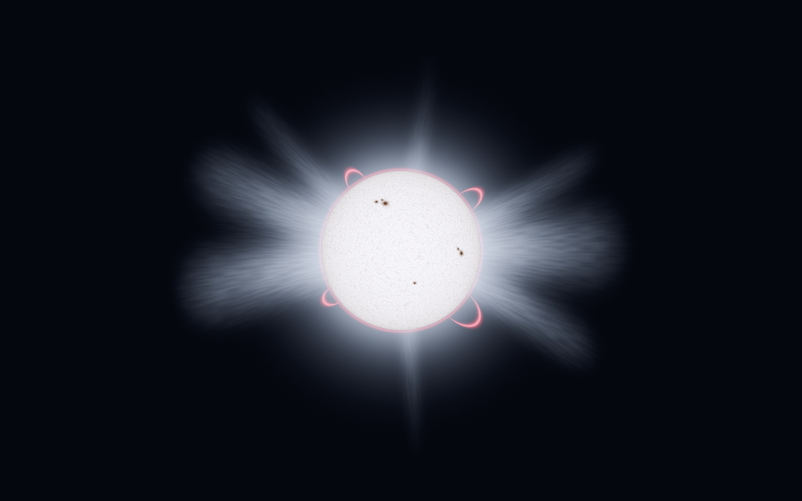</td>
    <td>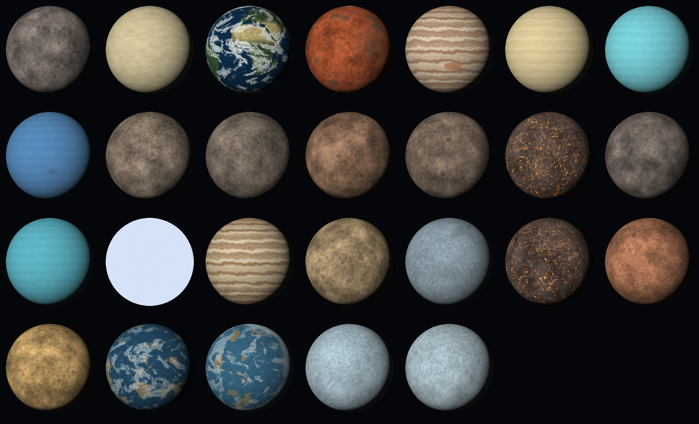</td>
  </tr>
  <tr>
    <td><sub><strong>The Sun.</strong> Voronoi granulation, sunspots at ±17–26°, limb darkening I(μ)/I(1) = 0.3 + 0.7 μ, corona to ~3 R☉.</sub></td>
    <td><sub><strong>26 worlds.</strong> Every body in the catalog, Mercury to TRAPPIST-1 h, plus Sirius B as a white dwarf.</sub></td>
  </tr>
</table>

<details>
<summary><strong>Asset review sheet</strong> (black hole, galaxies, worlds, Sun, warp atlas, debris atlas on one page)</summary>
<br>
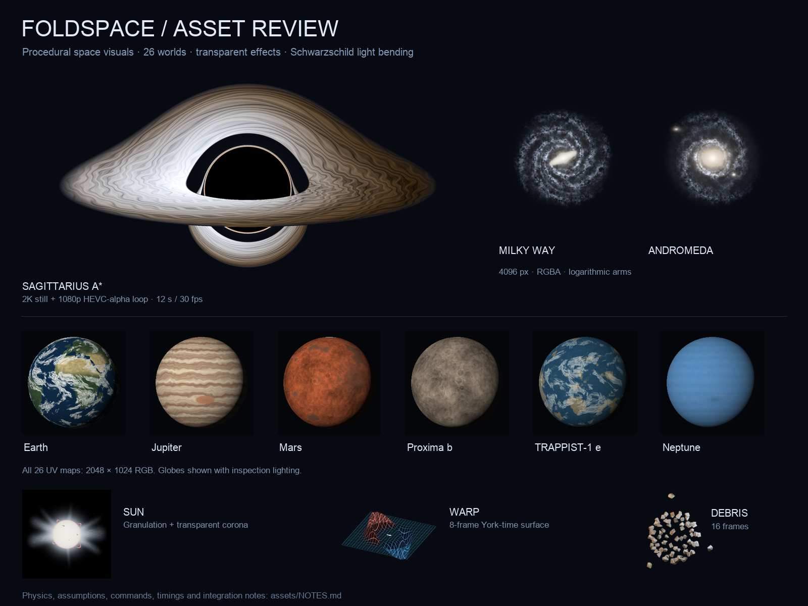
</details>

### Screenshots

<details>
<summary><strong>App screenshots, 01–07</strong> (generated by CI through the <code>FOLDSPACE_DEMO</code> launch hook)</summary>
<br>

The [build workflow](.github/workflows/build.yml) launches the app once per demo state on an iPhone 17 Pro simulator and saves these files as a CI artifact. They are committed to [`docs/screenshots/`](docs/screenshots/) after each capture run. Any that are not yet committed will show as missing images below. To capture them locally, see [Demo states](#demo-states).

| Cockpit (half-open) | Galaxy map (flat) | Outer display (closed, warping) |
|---|---|---|
|  |  |  |

| Sun dive | Nova Lance | Sagittarius A* | Andromeda |
|---|---|---|---|
|  |  |  |  |

</details>

---

## Three acts

| Act | You can… | You need… |
|---|---|---|
| **I · Stranded** | Hop between Solar System planets on normal engines. Drag the probe across the fold into the hologram to plant a beacon. | The three warp-drive parts: **Exotic Matter**, the **Field Coil** and the **Navigation Core**, hidden on Mars, Jupiter and Neptune |
| **II · Warp** | Pick a star on the galaxy map, close the phone, fold space (Alcubierre-style: squeeze space ahead, stretch it behind, ride the bubble in the crease). Explore or destroy each world. Destroying pays more energy, but whatever you might have found there is gone. | Dive into the Sun for the **Stellar Core Sample**, which unlocks the Nova Lance |
| **III · The Core** | Slingshot around Sagittarius A* (fold = gravity; Earth's clock races while yours crawls). Pump the hinge to charge the Fold Core, slam it shut, open it: the Milky Way behind you, Andromeda rising out of the corner. | A charged Fold Core |

## Where you can go (real astronomy)

| Destination | Distance | Warp cost | What's there |
|---|---|---|---|
| Solar System | home | — | Mercury → Neptune. Drive parts on Mars, Jupiter and Neptune. The Sun is divable |
| Alpha Centauri | 4.24 ly | 30 | Proxima b (1.07 M⊕, 11.2-day orbit, habitable zone) and Proxima d |
| Barnard's Star | 5.96 ly | 35 | Four sub-Earth planets confirmed 2024–2025 |
| Wolf 359 | 7.86 ly | 40 | A flare star with a candidate planet |
| Sirius | 8.6 ly | 45 | The brightest star in our sky and its white-dwarf companion |
| Epsilon Eridani | 10.5 ly | 50 | A young system with a gas giant and debris rings |
| Tau Ceti | 11.9 ly | 55 | Super-Earths e and f |
| TRAPPIST-1 | 40.7 ly | 80 | Seven Earth-sized planets, three in the habitable zone |
| **Sagittarius A\*** | 26,670 ly | 150 | The Milky Way's 4.3-million-solar-mass black hole. Fire the Nova Lance at it and the beam simply vanishes |
| **Andromeda** | 2,537,000 ly | Fold Core | The finale |

Every body carries a real blurb and real facts in [`UniverseData.swift`](Foldspace/Universe/UniverseData.swift). The Sun dive uses real layer temperatures: corona ~1,000,000 K, photosphere 5,800 K, core 15,000,000 K. Radii of non-transiting worlds are mass–radius estimates, used for render scale only.

---

## iPhone Duo APIs

| Duo capability | API | Where it's used |
|---|---|---|
| Continuous hinge angle | `onHingeChange { old, new in … }` → `DeviceHingeContext.hinge: DeviceHinge?` with `angle: Angle` and `status: .closed / .partiallyOpen / .fullyOpen` (iOS 27.1) | [`HingeSourceModifier.swift`](Foldspace/Hinge/HingeSourceModifier.swift) feeds `hinge.angle.degrees` into `HingeEngine`. Per Apple's guidance the angle drives *interactions and effects*, never layout |
| The fold and the camera | `proxy.reservedRegions(kind: .division)` and `reservedRegions(kind: .occlusion)` | [`FoldGeometry.seamRect(in:proxy:)`](Foldspace/Hinge/HingeSourceModifier.swift) + [`FoldSeam`](Foldspace/UI/Components/FoldSeam.swift): nothing interactive crosses the crease, except the probe drag, on purpose. `.occlusion` rects keep HUD readouts clear of the camera |
| Outer ↔ inner display continuity | posture `.closed` ↔ `.laptop` | [`OuterDisplayView`](Foldspace/UI/Outer/OuterDisplayView.swift) shows transit while closed; the cockpit resumes on open |
| Adaptive layout, no orientation lock | geometry-driven split; portrait and both landscapes enabled | [`RootView`](Foldspace/App/RootView.swift) and [`CockpitView`](Foldspace/UI/Cockpit/CockpitView.swift) split at the fold from `GeometryReader`, never at a fixed pixel. Size-class variants and Apple's `ArrangementView` are on the [roadmap](#roadmap) |
| Split View / multiple windows | `UIApplicationSupportsMultipleScenes` | On in [`project.yml`](project.yml); the galaxy map works as a second window |

> [!NOTE]
> **The `DUO_SDK` flag.** The Duo APIs ship in the Xcode 27.1 beta SDK, which needs macOS 26.6+. The hackathon build machine was on 26.5, so the native hinge path sits behind the `DUO_SDK` compilation condition. The same engine runs from three sources: the Duo hinge, an on-screen hinge control in the simulator, or CoreMotion tilt on a flat iPhone. [`scripts/build-duo.sh`](scripts/build-duo.sh) builds with the flag on. The [Bitrig](https://bitrig.com) Mac app's iPhone Duo simulator (folding + rotation) can also run the generated project.

---

## Sponsor stack: Supabase · OpenAI · Sentry

All three are **optional**. With no keys the game runs fully offline and every feature still works. The registry reports `OFFLINE`, the ship computer speaks with a deterministic voice built from the same real facts, and telemetry is a no-op.

| Tool | What it does in FOLDSPACE | Code |
|---|---|---|
| **Supabase** (Postgres + PostgREST) | The **Galactic Registry**. Every beacon, destroyed world, warp, core sample, slingshot and Andromeda arrival is `POST`ed to `public.events`. The HUD and the [live dashboard](docs/registry.html) read it back. Row-level security allows anon INSERT + SELECT and nothing else. Fire-and-forget, with an in-memory retry queue and an optimistic local echo. | [`GalacticRegistry.swift`](Foldspace/Network/GalacticRegistry.swift) · [`supabase/`](supabase/README.md) |
| **OpenAI** (chat completions, `gpt-5-mini` by default) | The **ship computer**: **NARRATE** the arrival, **ASK** about the current body, and write the **Commander's Log** at Andromeda. Strict system prompt (≤ 2 sentences, never invent numbers), fed only the body's real blurb and facts. 12 s timeout, then the offline voice. | [`ShipComputer.swift`](Foldspace/AI/ShipComputer.swift) · [`ConsoleView.swift`](Foldspace/UI/Cockpit/ConsoleView.swift) |
| **Sentry** (sentry-cocoa via SwiftPM) | Crash and error monitoring with automatic performance tracing. Every `GameStore.log` line becomes a breadcrumb, so a crash report carries the last 60 game events. OpenAI errors are captured as handled errors. | [`Telemetry.swift`](Foldspace/Config/Telemetry.swift) · [`FoldspaceApp.swift`](Foldspace/App/FoldspaceApp.swift) |

<details>
<summary><strong>Setting up keys: <code>Foldspace/Secrets.plist</code></strong></summary>
<br>

```bash
cp Foldspace/Secrets.example.plist Foldspace/Secrets.plist   # gitignored, never committed
open Foldspace/Secrets.plist                                 # fill in what you have
xcodegen generate                                            # once, so Xcode bundles the new resource
```

| Key | Where to get it | Empty means |
|---|---|---|
| `SUPABASE_URL` | Supabase → Project Settings → API → Project URL | registry offline |
| `SUPABASE_ANON_KEY` | same page → `anon` `public` key | registry offline |
| `OPENAI_API_KEY` | platform.openai.com → API keys (API credits, not a ChatGPT plan) | ship computer uses the offline voice |
| `OPENAI_MODEL` | any chat-completions model id | `gpt-5-mini` |
| `SENTRY_DSN` | sentry.io → Project → Settings → Client Keys (DSN) | Sentry never starts |

[`Secrets.swift`](Foldspace/Config/Secrets.swift) reads `Secrets.plist`, falls back to `Secrets.example.plist` (all empty), and lets a `FOLDSPACE_<KEY>` environment variable override either, which is handy in the simulator. Schema, RLS policies, seed rows and curl examples are in [`supabase/README.md`](supabase/README.md).

</details>

---

## Quick start

[](https://github.com/vnmoorthy/foldspace/actions/workflows/build.yml)

**Requirements:** macOS 26+, Xcode 26.3+ (Xcode 27.1 beta for the iPhone Duo simulator), [XcodeGen](https://github.com/yonaskolb/XcodeGen).

```bash
brew install xcodegen
git clone https://github.com/vnmoorthy/foldspace.git && cd foldspace
```

**Any iPhone simulator** (on-screen hinge control):

```bash
scripts/build-sim.sh                    # iPhone 17 Pro
DEVICE="iPhone 17" scripts/build-sim.sh
DEMO=blackhole scripts/build-sim.sh     # jump straight to a demo state
```

**iPhone Duo simulator** (native hinge, `DUO_SDK` on):

```bash
scripts/build-duo.sh                    # auto-detects Xcode-beta.app / Xcode_27*.app
XCODE=/Applications/Xcode-beta.app scripts/build-duo.sh
```

`build-duo.sh` checks for Xcode 27.x, the iPhone Duo device type and an iOS 27 runtime, creates an `iPhone Duo` simulator if there is none, then builds with `SWIFT_ACTIVE_COMPILATION_CONDITIONS='$(inherited) DUO_SDK'`. Fold the device from Device Hub; the on-screen control hides itself.

**In Xcode:** `xcodegen generate && open Foldspace.xcodeproj`, pick any iPhone simulator and run. Drive the hinge from the control at the bottom of the screen: **CLOSE**, **SLAM**, **HOP**, **SQUEEZE**, **SNAP**, **PUMP ×4**, or drag the lid yourself.

<details>
<summary><strong>Plain <code>xcodebuild</code></strong></summary>

```bash
xcodegen generate
xcodebuild -project Foldspace.xcodeproj -scheme Foldspace \
  -destination 'platform=iOS Simulator,name=iPhone 17 Pro' CODE_SIGNING_ALLOWED=NO build
```

</details>

### Demo states

For stage demos and screenshots, the app reads `FOLDSPACE_DEMO` at launch and jumps straight to a moment:

```bash
SIMCTL_CHILD_FOLDSPACE_DEMO=blackhole xcrun simctl launch booted com.vnmoorthy.foldspace
```

`cockpit` · `galaxy` · `outer` · `warp` · `sun` · `weapon` · `blackhole` · `andromeda`. The console's gear menu also has **Demo → Act II / Act III**.

### CI

[`.github/workflows/build.yml`](.github/workflows/build.yml) runs on every push to `main` that touches code, on GitHub's `macos-26` runner with Xcode 26.6. It generates the project, builds for the iPhone 17 Pro simulator, installs the app, launches all seven demo states, and uploads the screenshots, build log, crash triage log and a zipped `Foldspace.app` as artifacts.

---

## Architecture

Three objects live for the whole app: one `HingeEngine`, one `GameStore`, one `FlightController` (created in [`FoldspaceApp.swift`](Foldspace/App/FoldspaceApp.swift)). Views read the first two from the SwiftUI environment. **State only changes through `GameStore` methods**, and only two things call them: `FlightController` (the hinge) and the console buttons (touch). The full walkthrough is in [`docs/ARCHITECTURE.md`](docs/ARCHITECTURE.md).

### System overview

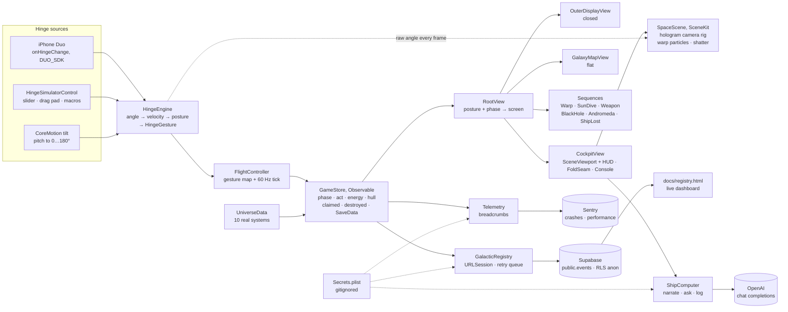

### Gesture state machine

Five detectors run on every sample of the 2.5 s ring. They share the ring but not state, which is why a squeeze that keeps going becomes a warp close without ever emitting a snap.

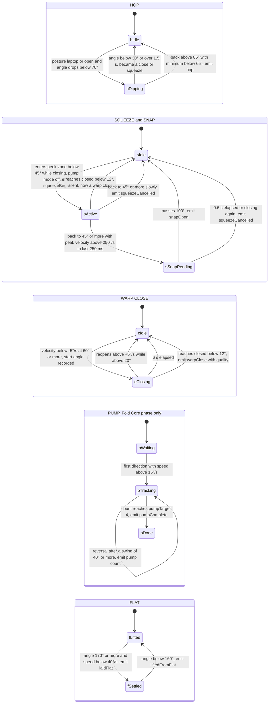

`warpQuality(avgSpeed:)` grades a close by its average speed from the start angle to closed:

| Average close speed | < 20°/s (crawl) | 20–60°/s | **60–160°/s (ideal)** | 160–320°/s | > 320°/s (slam) |
|---|---|---|---|---|---|
| Quality | 0.3 | 0.3 → 1.0 | **1.0** | 1.0 → 0.2 | 0.2 |

Below **0.45** the bubble collapses: you lose 15 hull (floor 20) and drop out short. Sagittarius A* is the exception: you arrive regardless.

### A warp jump

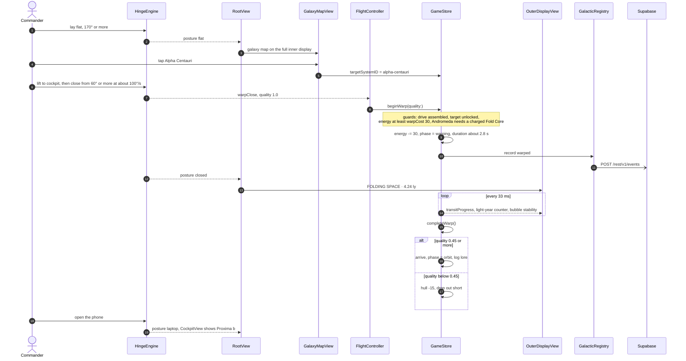

Transit time is `min(5, 2.2 + 0.9 × log10(distance))` seconds, or 7 s for the intergalactic jump.

### A sun dive

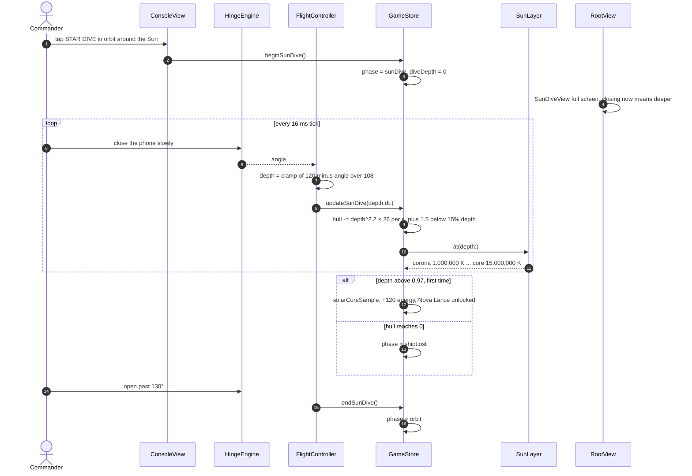

### A Nova Lance shot

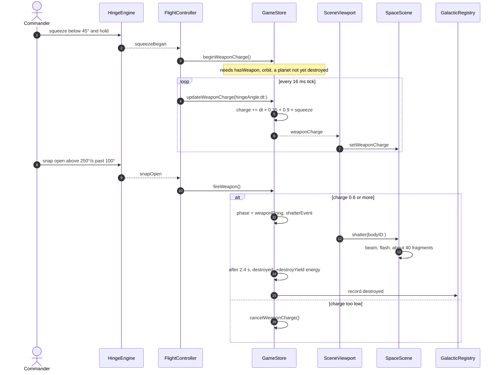

### Data model

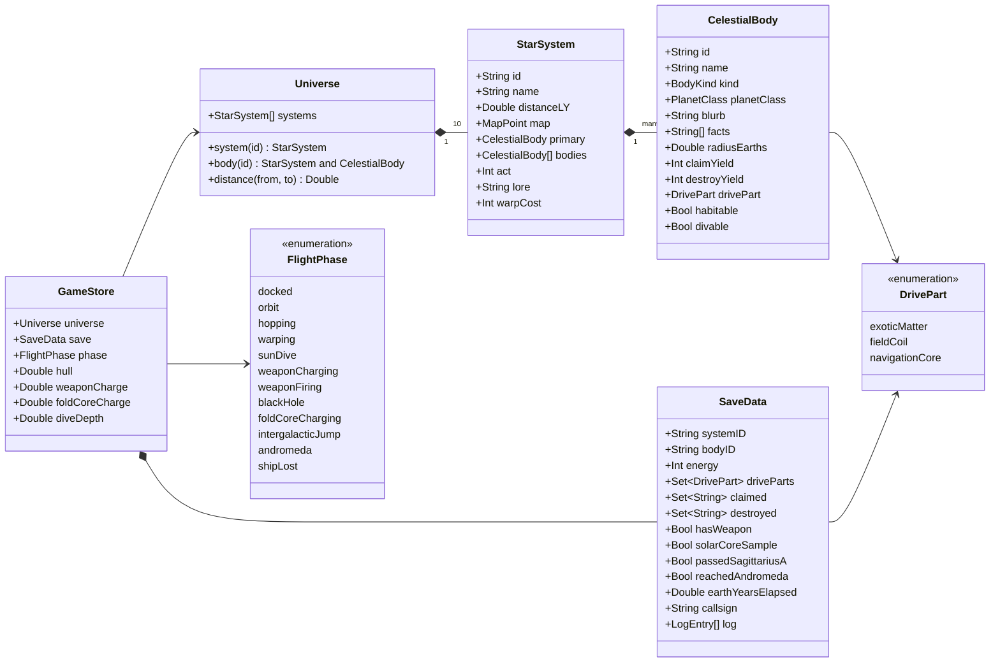

### Gesture recogniser reference

<details>
<summary><strong>Every gesture: trigger, emitted case, game verb</strong></summary>
<br>

| Gesture | Exact trigger in `HingeEngine.detectGestures` | `FlightController` → `GameStore` |
|---|---|---|
| `.hop` | Posture `.laptop`/`.open`, angle drops below 70°, then rises above 85° with a minimum below 65°, within 1.5 s and never below 30° | `hopToNextBody()` (0.9 s hop), haptic tap |
| `.warpClose(quality:)` | Velocity below −5°/s starting at ≥ 60°, reaches `.closed` (< 12°) within 6 s without reopening (> +5°/s above 20°). Quality from `warpQuality(avgSpeed:)` | `beginWarp(quality:)`; ignored during a sun dive; heavy haptic |
| `.squeezeBegan` | Enters `.peek` (12–45°) with velocity ≤ 0, pump mode off | `beginWeaponCharge()` |
| `.snapOpen` | Leaves the squeeze at ≥ 45° with peak velocity > 250°/s in the last 250 ms, then passes 100° within 0.6 s | `fireWeapon()`; heavy haptic on a hit, warning if charge < 0.6 |
| `.squeezeCancelled` | Leaves the squeeze slowly, or a pending snap stalls or reverses | `cancelWeaponCharge()` |
| `.pump(count:)` | Pump mode only: direction reversal (speed above 15°/s) after a swing ≥ 40° | `recordPump(count:target:)`, charge = count / 4 |
| `.pumpComplete` | `pumpCount` reaches `pumpTarget` (4) | `foldCoreCharged()`, success haptic |
| `.laidFlat` | Angle ≥ 170° and speed below 40°/s | haptic only; `RootView` shows the map from posture |
| `.liftedFromFlat` | Angle drops below 160° after settling flat | haptic only |

Pump mode is owned by `FlightController`: its tick sets `hinge.pumpModeEnabled = (phase == .foldCoreCharging)`. That is why the squeeze detector checks `!pumpModeEnabled`: four pumps swing through the peek zone and must not charge the lance.

**`HingeEngine` API**

| Member | Purpose |
|---|---|
| `ingest(angle:timestamp:)` | Feed an absolute angle (0…180°). Clamps, smooths velocity (`0.35 × prev + 0.65 × instant`), updates posture, runs detectors |
| `nudge(by:)` | Relative change, used by the drag pad |
| `animate(to:duration:)` | Eased sweep at 60 steps/s, used by the simulator macros and demos |
| `resetPumps()` | Zero the pump counter and direction |
| `static warpQuality(avgSpeed:)` | Close-speed → 0.2…1.0 grade |
| `angle`, `velocity`, `posture`, `lastGesture`, `pumpCount` | Read-only observable state |
| `fold` | 0 flat … 1 closed, for shaders |
| `source` | `.simulated`, `.motion` (starts CoreMotion) or `.duo` |
| `pumpModeEnabled`, `pumpTarget`, `onGesture` | Pump switch, pumps required (4), gesture sink |

</details>

### GameStore API reference

<details>
<summary><strong>Every public method on <code>GameStore</code></strong></summary>
<br>

| Method | What it does |
|---|---|
| `log(_:_:)` | Append a log line (kept to 60), emit a Sentry breadcrumb, show a toast, persist |
| `claim(_:)` | Plant a beacon: +`claimYield` energy, may recover a drive part; records `claimed` or `driveAssembled` |
| `hopToNextBody()` | From orbit, hop to the next living body in the system |
| `hop(to:)` | 0.9 s in-system transit to a specific body |
| `beginWarp(quality:)` | Guarded fold to `targetSystem`: spends `warpCost`, runs the transit, records `warped` |
| `completeWarp()` | Arrive, or collapse if quality < 0.45; enters `.blackHole` at Sagittarius A*, `.andromeda` after the jump |
| `beginWeaponCharge()` | Enter `.weaponCharging` if the lance is unlocked and the body is a planet |
| `updateWeaponCharge(hingeAngle:dt:)` | Charge faster the tighter the squeeze |
| `cancelWeaponCharge()` | Back to orbit, charge zeroed |
| `fireWeapon()` | At charge ≥ 0.6: shatter, then after 2.4 s destroy for +`destroyYield`. At Sagittarius A* the beam vanishes |
| `beginSunDive()` | Enter `.sunDive` around a divable star |
| `updateSunDive(depth:dt:)` | Burn hull by depth; core sample at depth > 0.97; `.shipLost` at 0 hull |
| `endSunDive()` | Climb out to orbit |
| `blackHoleEscaped()` | Mark the slingshot passed, unlock the Fold Core, record `passedBlackHole` |
| `blackHoleConsumed()` | Ship lost to the event horizon |
| `addEarthYears(_:)` | Accumulate time-dilation years at Sagittarius A* |
| `beginFoldCoreCharge()` | Enter `.foldCoreCharging`, target Andromeda |
| `recordPump(count:target:)` | Fold Core charge = count / target |
| `foldCoreCharged()` | Fold Core at 100% |
| `cancelFoldCoreCharge()` | Abort the charge |
| `respawn()` | Backup ship: hull 100, back in orbit |
| `repair()` | −20 energy, hull back to 100 |
| `reset()` | New commander, fresh save |
| `demoSkip(to:)` | Jump to Act I, II or III for stage demos |
| `persist()` | JSON-encode `SaveData` into `UserDefaults` (`foldspace.save.v1`) |
| `isClaimed(_:)`, `isDestroyed(_:)`, `isUnlocked(_:)` | Queries |

Derived state: `currentSystem`, `currentBody`, `targetSystem`, `hasWarpDrive`, `act`, `energy`, `livingBodies`, `reachableSystems`.

</details>

### Repository map

| Path | Purpose |
|---|---|
| [`Foldspace/`](Foldspace/) | The app: Swift sources, `Info.plist`, `Secrets.example.plist` |
| [`Foldspace.xcodeproj/`](Foldspace.xcodeproj/) | Generated Xcode project (regenerate with `xcodegen generate`) |
| [`project.yml`](project.yml) | XcodeGen spec: iOS 26 target, Sentry package, `DUO_SDK` hook, bundled `assets/` |
| [`scripts/`](scripts/) | `build-sim.sh` (any iPhone simulator), `build-duo.sh` (iPhone Duo simulator with `DUO_SDK`) |
| [`assets/`](assets/) | Blender renders bundled into the app: `textures/`, `sprites/`, `video/`, `manifest.json`, `NOTES.md` |
| [`blender/`](blender/) | Headless Blender generators; [`blender/codex/`](blender/codex/) holds the final asset pipeline and validator |
| [`supabase/`](supabase/) | Galactic Registry: `migrations/`, `seed.sql`, setup README |
| [`docs/`](docs/) | Landing page, live dashboard, hero, architecture, deck, script, `screenshots/`, `visuals/`, `site/` media, `tools/` |
| [`.github/`](.github/) | CI workflow and issue templates |
| [`CONTRIBUTING.md`](CONTRIBUTING.md) | Build, layout, adding a star system, PR expectations |
| [`LICENSE`](LICENSE) | MIT |

<details>
<summary><strong>Source tree</strong></summary>

```
Foldspace/
├── App/          FoldspaceApp (Sentry start · environment wiring · demo hook), RootView
├── Config/       Secrets (Secrets.plist loader), Telemetry (Sentry breadcrumbs / captures)
├── Hinge/        HingeState, HingeEngine, HingeSourceModifier (DUO_SDK), HingeSimulatorControl
├── Game/         GameStore, FlightController
├── Universe/     Universe (models), UniverseData (catalog)
├── Scene/        SpaceScene, PlanetMaterials, SceneViewport
├── AI/           ShipComputer (OpenAI chat completions + deterministic offline voice)
├── Network/      GalacticRegistry (Supabase PostgREST client, retry queue)
├── UI/
│   ├── Cockpit/    CockpitView, ConsoleView (SHIP COMPUTER panel), HUDOverlay
│   ├── GalaxyMap/  GalaxyMapView
│   ├── Outer/      OuterDisplayView
│   ├── Sequences/  WarpSequenceView, SunDiveView, WeaponView, BlackHoleView,
│   │               AndromedaFinaleView (Commander's Log), ShipLostView
│   └── Components/ Theme, Haptics, FoldSeam, TransparentLoopingMovie, VisualAssets
├── Secrets.example.plist   template: copy to Secrets.plist (gitignored)
└── Info.plist
```

</details>

---

## Blender pipeline

Every visual is generated headlessly in Blender 5.2 and checked by a validator before it ships.

- [`docs/BLENDER-VISUALS-PLAN.md`](docs/BLENDER-VISUALS-PLAN.md): the plan: physics, look-dev, who built what.
- [`docs/BLENDER-CODEX-BRIEF.md`](docs/BLENDER-CODEX-BRIEF.md): the asset contract: file names, sizes, formats, the physics each image must obey.
- [`blender/README.md`](blender/README.md): how to run the scripts (`--quick` / `--final`, device notes, output naming).
- [`blender/codex/`](blender/codex/): the final generators (`blackhole.py`, `planets.py`, `sun.py`, `galaxies.py`, `warp.py`, `shatter.py`) and `validate_assets.py --final`.
- [`assets/NOTES.md`](assets/NOTES.md): the delivered set: 42 PNGs + one HEVC-alpha movie, with method, approximations and SHA-256 hashes in [`manifest.json`](assets/manifest.json).

## Deck & talk

| | |
|---|---|
| [`docs/FOLDSPACE-Deck.pptx`](docs/FOLDSPACE-Deck.pptx) | 10-slide deck with speaker notes and real Blender renders |
| [`docs/FOLDSPACE-Deck.pdf`](docs/FOLDSPACE-Deck.pdf) | The same deck as a PDF (opens in the browser, no PowerPoint needed) |
| [`docs/PRESENTATION-SCRIPT.md`](docs/PRESENTATION-SCRIPT.md) | The 3-minute script: every spoken line, every hinge beat, pre-show checklist |
| [`docs/ARCHITECTURE.md`](docs/ARCHITECTURE.md) | Code walkthrough: recogniser, flight loop, store, scene, sponsor stack |
| [`docs/BLENDER-VISUALS-PLAN.md`](docs/BLENDER-VISUALS-PLAN.md) · [`docs/BLENDER-CODEX-BRIEF.md`](docs/BLENDER-CODEX-BRIEF.md) · [`blender/README.md`](blender/README.md) | Visuals plan, asset brief, Blender how-to |
| [`supabase/README.md`](supabase/README.md) | Registry setup: project, migration, RLS, curl |
| [`docs/registry.html`](docs/registry.html) | Live Galactic Registry dashboard |
| [`docs/index.html`](docs/index.html) | Landing page source, live on GitHub Pages at **[vnmoorthy.github.io/foldspace](https://vnmoorthy.github.io/foldspace/)** |

---

## Roadmap

- [ ] Run on iPhone Duo hardware with `DUO_SDK` on by default once the SDK reaches the stable Xcode
- [ ] Size-class layout variants and Apple's `ArrangementView` for the flat and Split View layouts
- [ ] Commit CI screenshots automatically to `docs/screenshots/`
- [ ] Kerr (spinning) black hole: frame dragging around Sagittarius A*
- [ ] More systems from the NASA Exoplanet Archive
- [ ] Shared multiplayer registry views: see other commanders' beacons on the galaxy map

## FAQ

<details>
<summary><strong>Why is the hinge simulated?</strong></summary>
<br>
The iPhone Duo APIs (<code>onHingeChange</code>, reserved regions) ship in the Xcode 27.1 beta SDK, which needs macOS 26.6+. The hackathon build machine was on 26.5. So the native path is behind the <code>DUO_SDK</code> flag, and the same <code>HingeEngine</code> is fed by an on-screen hinge control or CoreMotion tilt. On Xcode 27.1, <code>scripts/build-duo.sh</code> turns the flag on and the Duo simulator drives the game directly.
</details>

<details>
<summary><strong>Does it run on a normal iPhone?</strong></summary>
<br>
Yes. Every hinge verb is also a console button, the on-screen control has CLOSE / SLAM / HOP / SQUEEZE / SNAP / PUMP ×4 macros, and the Motion source lets you tilt a flat iPhone like a lid. The two-screen corner and outer display only make full sense on a Duo.
</details>

<details>
<summary><strong>Is the physics real?</strong></summary>
<br>
The data is: distances, masses, orbits and temperatures come from the NASA Exoplanet Archive, the Event Horizon Telescope collaboration and NASA's Sun fact sheets. The black hole is a numerical Schwarzschild ray trace. The game mechanics are playful: the warp is Alcubierre taken literally, not a working drive, and the black-hole disc is a cinematic teaching model. <a href="assets/NOTES.md"><code>assets/NOTES.md</code></a> lists every approximation.
</details>

<details>
<summary><strong>Why no Star Wars names?</strong></summary>
<br>
It is an original game with real astronomy. The weapon is the <strong>Nova Lance</strong>, the jump engine is the <strong>Fold Core</strong>, and every destination is a real place.
</details>

<details>
<summary><strong>Can I add planets?</strong></summary>
<br>
Yes. Add a <code>StarSystem</code> to <a href="Foldspace/Universe/UniverseData.swift"><code>UniverseData.swift</code></a> with real facts, a map point, an act and a warp cost. Procedural materials cover any <code>PlanetClass</code> with no texture needed. See <a href="CONTRIBUTING.md">CONTRIBUTING.md</a>.
</details>

## Contributing

Issues and PRs are welcome. Read [CONTRIBUTING.md](CONTRIBUTING.md) for building, the code layout and how to add a star system. Bug reports and feature ideas use the [issue templates](.github/ISSUE_TEMPLATE/).

## Credits

Built by [vnmoorthy](https://github.com/vnmoorthy) at Bitrig Hacks with Claude Code. Astronomy data from the NASA Exoplanet Archive, the Event Horizon Telescope collaboration and NASA's Sun fact sheets. Black-hole method after Luminet (1979) and James, von Tunzelmann, Franklin & Thorne (2015). Sponsor stack: [Supabase](https://supabase.com), [OpenAI](https://openai.com), [Sentry](https://sentry.io).

## License

[MIT](LICENSE)
