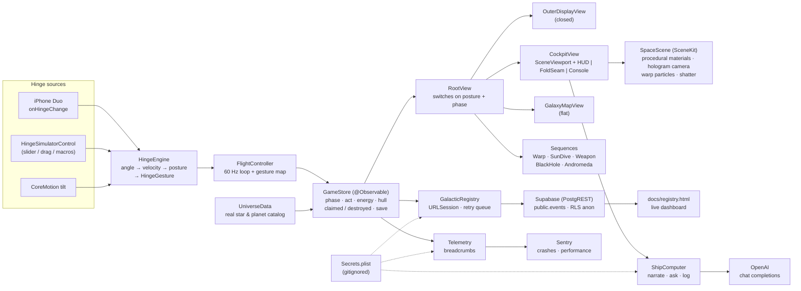

<p align="center">
  
</p>

<h1 align="center">FOLDSPACE</h1>
<p align="center"><strong>Fold the phone. Fold space.</strong></p>
<p align="center">A space-exploration game where the iPhone Duo's hinge <em>is</em> the ship.<br>Built in one day at <a href="https://events.ycombinator.com/bitrig-hacks-september2026">Bitrig Hacks: iPhone Duo Edition</a> (Y Combinator, Sept 26 2026).</p>

<p align="center">
  <a href="https://vnmoorthy.github.io/foldspace/">Landing page</a> ·
  <a href="docs/ARCHITECTURE.md">Architecture</a> ·
  <a href="docs/FOLDSPACE-Deck.pptx">Slide deck</a> ·
  <a href="docs/PRESENTATION-SCRIPT.md">3-minute script</a> ·
  <a href="supabase/README.md">Supabase registry</a> ·
  <a href="docs/registry.html">Live dashboard</a>
</p>

<p align="center">
  
  
  
  
  
</p>

---

## The idea in one breath

Foldable phones have had hinge-angle sensors for years. Everyone used them for **animations**.
We used the hinge as an **input device**, and then we used both screens as a **3D corner**.

> Close the phone smoothly and you fold space to the next star. Squeeze it and snap it open and a planet shatters in the crease. Pump it like a bellows to charge the jump to Andromeda. Close it slowly while orbiting the Sun and you dive into the core.

None of this is possible on a flat iPhone. All of it uses what is unique to iPhone Duo: the continuous hinge angle, two displays that meet at a known angle, an outer display that faces the world when the phone is closed, and a 7.6" canvas with a fold across it.

## Screenshots

| Cockpit (phone half-open) | Galaxy map (phone flat) | Outer display (phone closed, warping) |
|---|---|---|
|  |  |  |

| Diving into the Sun | Nova Lance (squeeze + snap) | Sagittarius A* slingshot | Andromeda |
|---|---|---|---|
|  |  |  |  |

## The phone is the ship

Every hinge posture is a flight state. Every hinge motion is a verb.

| Hinge posture | Angle | What you see | What it means |
|---|---|---|---|
| **Closed** | 0–12° | Outer 5.4" display | Docked, or **in transit** ("FOLDING SPACE · 4.24 ly") |
| **Squeezed** | 12–45° | Crease glows | **Nova Lance charging** |
| **Cockpit** | 45–135° | Windshield above the fold, console below | Flying. The planet **hologram sits in the fold** |
| **Open** | 135–170° | Wide cockpit | Flying |
| **Flat** | 170–180° | Whole 7.6" inner display | **Galaxy map** |

| Hinge gesture | Detected as | Game verb |
|---|---|---|
| Dip the lid and bring it back | `.hop` | **Hop** to the next planet in the system |
| Close the phone smoothly (60–160°/s) | `.warpClose(quality:)` | **Warp**: fold space to the targeted star. Slam it or crawl and the bubble collapses |
| Squeeze to < 45° and hold | `.squeezeBegan` | **Charge** the Nova Lance |
| Snap it open (> 250°/s) | `.snapOpen` | **Fire**. The planet shatters in 3D in the corner |
| Pump open/shut four times, then slam | `.pump(count:)` → `.pumpComplete` | **Charge the Fold Core** for the 2.5-million-light-year jump |
| Close slowly while orbiting the Sun | continuous angle | **Dive**: depth = fold amount. Open the phone to climb out |
| Lay it flat | `.laidFlat` | **Galaxy map** |

The recogniser lives in [`Foldspace/Hinge/HingeEngine.swift`](Foldspace/Hinge/HingeEngine.swift): a 2.5-second ring of `(angle, velocity, t)` samples, turned into discrete gestures with hysteresis so a squeeze never reads as a warp and a hop never reads as a close.

## The hologram in the fold

The famous 3D corner billboards (the wave in Seoul) work by drawing one scene across two surfaces that meet at an angle. iPhone Duo is exactly that, and it **knows its own angle**. [`SpaceScene`](Foldspace/Scene/SpaceScene.swift) drives the SceneKit camera from the live hinge angle so the planet appears to sit *in* the crease: standing on the console half, rising into the windshield half. Open or close the phone and the object stays put in space while the screens move around it.

## Where you can go (real astronomy)

| Destination | Distance | What's there |
|---|---|---|
| Solar System | home | Mercury → Neptune. The three warp-drive parts are hidden on Mars, Jupiter and Neptune. The Sun is divable. |
| Alpha Centauri | 4.24 ly | Proxima b (1.07 M⊕, 11.2-day orbit, habitable zone) and Proxima d |
| Barnard's Star | 5.96 ly | Four sub-Earth planets confirmed 2024–2025 |
| Wolf 359 | 7.86 ly | A flare star with a candidate planet |
| Sirius | 8.6 ly | The brightest star in our sky and its white-dwarf companion |
| Epsilon Eridani | 10.5 ly | A young system with a gas giant and debris rings |
| Tau Ceti | 11.9 ly | Super-Earths e and f |
| TRAPPIST-1 | 40.7 ly | Seven Earth-sized planets, three in the habitable zone |
| **Sagittarius A\*** | 26,670 ly | The Milky Way's 4-million-solar-mass black hole. Fold = gravity. Earth's clock races while yours crawls. Fire the Nova Lance at it and the beam simply vanishes. |
| **Andromeda** | 2,537,000 ly | The finale |

Every planet has a real blurb and real facts in [`UniverseData.swift`](Foldspace/Universe/UniverseData.swift). The Sun dive uses the real layer temperatures: corona ~1,000,000 K, photosphere 5,800 K, core 15,000,000 K.

## Three acts

1. **Stranded.** You're in the Solar System with normal engines. Hop between planets, drag the probe across the fold into the hologram to plant a beacon, recover Exotic Matter, the Field Coil and the Navigation Core. Assemble the warp drive.
2. **Warp.** Pick a star on the galaxy map, close the phone, and fold space (Alcubierre-style: squeeze space ahead, stretch it behind, ride the bubble in the crease). Explore or destroy each world. Destroying yields more energy but you lose whatever you might have found. Dive into the Sun for the Stellar Core Sample that unlocks the Nova Lance.
3. **The Core.** Slingshot around Sagittarius A*, then pump the hinge to charge the Fold Core and slam it shut. Open it: the Milky Way behind you, Andromeda rising out of the corner.

## iPhone Duo APIs

| Duo capability | Where it's used |
|---|---|
| `onHingeChange` (hinge status + continuous angle) | [`HingeSourceModifier.swift`](Foldspace/Hinge/HingeSourceModifier.swift) feeds `HingeEngine` |
| Reserved regions: `.division` (the fold), `.occlusion` (camera) | [`FoldGeometry`](Foldspace/Hinge/HingeSourceModifier.swift) + [`FoldSeam`](Foldspace/UI/Components/FoldSeam.swift): nothing interactive crosses the crease; the probe drag *deliberately* does |
| Outer display ↔ inner display continuity | [`OuterDisplayView`](Foldspace/UI/Outer/OuterDisplayView.swift) shows transit while closed; the cockpit resumes on open |
| Size classes instead of orientation locks | [`RootView`](Foldspace/App/RootView.swift), [`CockpitView`](Foldspace/UI/Cockpit/CockpitView.swift) split at the fold, never at a fixed pixel |
| Split View / multiple windows | `UIApplicationSupportsMultipleScenes` is on; the galaxy map is a fine second window |

**Build-flag note.** Xcode 27.1 beta (the first SDK with the Duo APIs) requires macOS 26.6+; the build machine at the hackathon was on 26.5. The native hinge path is behind the `DUO_SDK` compilation condition in `project.yml` and `HingeSourceModifier.swift`, so the same engine runs from three sources: the Duo hinge, an on-screen hinge control in the simulator, or CoreMotion tilt on a flat iPhone. Flip the flag on Xcode 27.1 and the Duo simulator drives the game directly.

## Sponsor stack: Supabase · OpenAI · Sentry

Three hackathon sponsor tools power everything outside the phone. All three are **optional**: with no keys the game runs fully offline and every feature still works — the registry reports `OFFLINE`, the ship computer speaks with a deterministic voice built from the same real facts, and telemetry is a no-op.

| Tool | What it does in FOLDSPACE | Code |
|---|---|---|
| **Supabase** (Postgres + PostgREST) | The **Galactic Registry**. Every beacon, destroyed world, warp, core sample, slingshot and Andromeda arrival is `POST`ed to `public.events`; the HUD and the [live dashboard](docs/registry.html) read it back. Row-level security allows anon INSERT + SELECT and nothing else. Fire-and-forget with an in-memory retry queue and an optimistic local echo. | [`Network/GalacticRegistry.swift`](Foldspace/Network/GalacticRegistry.swift) · [`supabase/`](supabase/README.md) |
| **OpenAI** (chat completions, `gpt-5-mini` by default) | The **ship computer** in the console: **NARRATE** the arrival at the current body, **ASK** it anything about that body, and the **Commander's Log** on the Andromeda finale. The model gets a strict system prompt (≤ 2 sentences, never invent numbers) and only the body's real blurb + facts as source material. 12 s timeout, then the offline voice. | [`AI/ShipComputer.swift`](Foldspace/AI/ShipComputer.swift) · [`UI/Cockpit/ConsoleView.swift`](Foldspace/UI/Cockpit/ConsoleView.swift) |
| **Sentry** (sentry-cocoa via SwiftPM) | Crash + error monitoring with automatic performance tracing. Every `GameStore.log` line becomes a breadcrumb, so a crash report carries the last 60 game events; OpenAI API errors are captured as handled errors. | [`Config/Telemetry.swift`](Foldspace/Config/Telemetry.swift) · [`App/FoldspaceApp.swift`](Foldspace/App/FoldspaceApp.swift) |

### Keys · `Foldspace/Secrets.plist`

```bash
cp Foldspace/Secrets.example.plist Foldspace/Secrets.plist   # gitignored — never committed
open Foldspace/Secrets.plist                                 # fill in what you have
xcodegen generate                                            # once, so Xcode bundles the new resource
```

| Key | Where to get it | Empty means |
|---|---|---|
| `SUPABASE_URL` | Supabase → Project Settings → API → Project URL | registry offline |
| `SUPABASE_ANON_KEY` | same page → `anon` `public` key | registry offline |
| `OPENAI_API_KEY` | platform.openai.com → API keys (API credits, not a ChatGPT plan) | ship computer uses the offline voice |
| `OPENAI_MODEL` | any chat-completions model id | `gpt-5-mini` |
| `SENTRY_DSN` | sentry.io → Project → Settings → Client Keys (DSN) | Sentry never starts |

[`Config/Secrets.swift`](Foldspace/Config/Secrets.swift) reads `Secrets.plist`, falls back to `Secrets.example.plist` (all empty), and lets a `FOLDSPACE_<KEY>` environment variable override either — handy in the simulator. Database schema, RLS policies, seed rows and curl examples live in [`supabase/README.md`](supabase/README.md).

## Architecture



A deeper walkthrough with a warp-jump sequence diagram is in [`docs/ARCHITECTURE.md`](docs/ARCHITECTURE.md).

```
Foldspace/
├── App/          FoldspaceApp (Sentry start · environment wiring), RootView
├── Config/       Secrets (Secrets.plist loader), Telemetry (Sentry breadcrumbs / captures)
├── Hinge/        HingeState, HingeEngine, HingeSourceModifier (DUO_SDK), HingeSimulatorControl
├── Game/         GameStore, FlightController
├── Universe/     Universe (models), UniverseData (catalog)
├── Scene/        SpaceScene, PlanetMaterials, SceneViewport
├── AI/           ShipComputer (OpenAI chat completions + deterministic offline voice)
├── Network/      GalacticRegistry (Supabase PostgREST client, retry queue)
├── UI/
│   ├── Cockpit/  CockpitView, ConsoleView (SHIP COMPUTER panel), HUDOverlay
│   ├── GalaxyMap/GalaxyMapView
│   ├── Outer/    OuterDisplayView
│   ├── Sequences/WarpSequenceView, SunDiveView, WeaponView, BlackHoleView, AndromedaFinaleView (Commander's Log), ShipLostView
│   └── Components/Theme, Haptics, FoldSeam
├── Secrets.example.plist   template — copy to Secrets.plist (gitignored)
└── Info.plist
supabase/         migrations/ (events table · RLS · galactic_stats view), seed.sql, README (setup + curl)
docs/             registry.html (live dashboard), landing page, hero, architecture, deck, script, screenshots
```

## Run it

Requirements: macOS 26+, Xcode 26.3+ (Xcode 27.1 beta for the iPhone Duo simulator), [xcodegen](https://github.com/yonaskolb/XcodeGen).

```bash
brew install xcodegen
```

```bash
git clone https://github.com/vnmoorthy/foldspace.git && cd foldspace && xcodegen generate && open Foldspace.xcodeproj
```

Optional: `cp Foldspace/Secrets.example.plist Foldspace/Secrets.plist`, fill in the Supabase / OpenAI / Sentry keys, and run `xcodegen generate` again — see [Sponsor stack](#sponsor-stack-supabase--openai--sentry).

Pick any iPhone simulator and run. Use the hinge control at the bottom of the screen: **CLOSE**, **SLAM**, **HOP**, **SQUEEZE**, **SNAP**, **PUMP ×4**, or drag the lid yourself.

On Xcode 27.1 with the iPhone Duo simulator: add `DUO_SDK` to *Active Compilation Conditions* (or in `project.yml`), run on **iPhone Duo**, and fold the device from Device Hub. The on-screen control hides itself.

Command line:

```bash
xcodebuild -project Foldspace.xcodeproj -scheme Foldspace -destination 'platform=iOS Simulator,name=iPhone 17 Pro' CODE_SIGNING_ALLOWED=NO build
```

### Demo states

For stage demos the app accepts an environment variable at launch so you can jump straight to a moment:

```bash
SIMCTL_CHILD_FOLDSPACE_DEMO=blackhole xcrun simctl launch booted com.vnmoorthy.foldspace
```

`cockpit` · `galaxy` · `outer` · `warp` · `sun` · `weapon` · `blackhole` · `andromeda`. The gear menu in the console also has **Demo → Act II / Act III**.

## Why this couldn't exist before

- A flat iPhone has no angle. There is nothing to close, squeeze, snap or pump.
- A flat iPhone has one plane. There is no corner for a hologram to sit in.
- A flat iPhone has one face. There is no display that shows "FOLDING SPACE" to the world while the ship is in transit.

iPhone Duo has all three, and tells the app about them continuously. FOLDSPACE is what you get when you take that literally.

## Credits

Built by [vnmoorthy](https://github.com/vnmoorthy) at Bitrig Hacks with Claude Code. Astronomy data from the NASA Exoplanet Archive, the Event Horizon Telescope collaboration and NASA's Sun fact sheets. No Star Wars was harmed: the weapon is the **Nova Lance**.

## License

MIT
