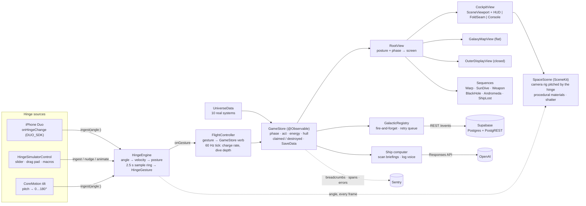
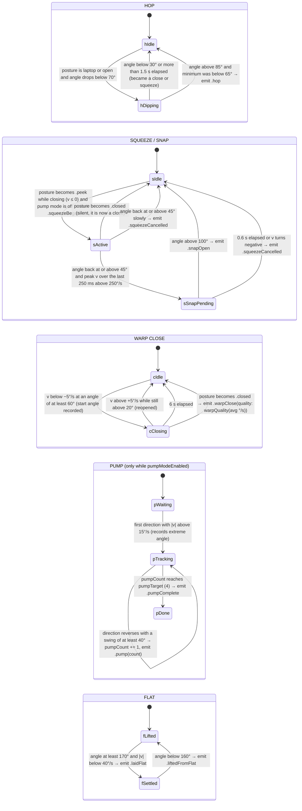

# FOLDSPACE architecture

FOLDSPACE is a SwiftUI + SceneKit game for iPhone Duo in which the hinge is the controller. This document walks the code as it is in the repository: the hinge recogniser, the flight controller, the game store, the views and the 3D scene, and where the sponsor stack (Supabase, OpenAI, Sentry) attaches.

Three objects live for the whole app (`Foldspace/App/FoldspaceApp.swift`): one `HingeEngine`, one `GameStore`, one `FlightController`. Every view reads the first two from the SwiftUI environment; no view takes init parameters.

- [System overview](#system-overview)
- [A warp jump, end to end](#a-warp-jump-end-to-end)
- [The gesture recogniser](#the-gesture-recogniser)
- [Modules](#modules)
- [Data flow: a sun dive](#data-flow-a-sun-dive)
- [Data flow: a Nova Lance shot](#data-flow-a-nova-lance-shot)
- [Sponsor stack](#sponsor-stack)

## System overview



Two things to notice. First, the hinge reaches the scene twice: as discrete gestures through `FlightController`, and as the raw angle straight into `SpaceScene.setHinge(angle:)` so the hologram camera tracks the physical fold every frame. Second, everything to the right of `GameStore` only observes; the only way state changes is through the store's methods, and the only things that call those methods are `FlightController` (hinge) and the console buttons (touch).

## A warp jump, end to end

The commander lays the phone flat, picks Alpha Centauri, lifts the phone and closes it smoothly.

```mermaid
sequenceDiagram
    autonumber
    actor Cmdr as Commander
    participant HE as HingeEngine
    participant RV as RootView
    participant GM as GalaxyMapView
    participant FC as FlightController
    participant GS as GameStore
    participant OD as OuterDisplayView
    participant SC as SpaceScene
    participant GR as GalacticRegistry
    participant SB as Supabase

    Cmdr->>HE: lay flat (angle ≥ 170°, velocity under 40°/s)
    HE-->>FC: .laidFlat (haptic tap only)
    HE-->>RV: posture == .flat
    RV->>GM: show galaxy map on the full inner display
    Cmdr->>GM: tap Alpha Centauri
    GM->>GS: targetSystemID = "alpha-centauri"
    Cmdr->>HE: lift (angle below 160°)
    HE-->>RV: posture == .laptop → CockpitView
    Cmdr->>HE: close from ≥ 60° to below 12° at ~100°/s
    HE-->>FC: .warpClose(quality: 1.0)
    FC->>GS: beginWarp(quality:)
    Note over GS: guards: drive assembled, target set and unlocked,<br/>energy ≥ warpCost (30), Andromeda needs a charged Fold Core
    GS->>GS: energy −= 30 · phase = .warping(to:) · duration = 2.2 + 0.9·log10(4.24) ≈ 2.8 s
    GS->>GR: record(.warped, body: "alpha-centauri", energy:)
    GR-)SB: POST /rest/v1/events {callsign, event, body, energy}
    Note over GR,SB: fire-and-forget; on failure the payload is queued (max 50)<br/>and flushed by the next refresh()
    HE-->>RV: posture == .closed
    RV->>OD: OuterWarpCard "FOLDING SPACE · 4.24 ly"
    loop every 33 ms until progress = 1
        GS->>GS: transitProgress += 1/steps
        GS-->>OD: light-year counter, bubble stability = lastWarpQuality
    end
    GS->>GS: completeWarp()
    alt quality ≥ 0.45
        GS->>GS: systemID = alpha-centauri · bodyID = first body · phase = .orbit
        GS->>GS: log "Arrived: Alpha Centauri." + lore
    else quality under 0.45 (slam or crawl)
        GS->>GS: hull −15 (floor 20) · stay home · log "Warp bubble collapsed"
    end
    Cmdr->>HE: open the phone
    HE-->>RV: posture == .laptop → CockpitView
    RV->>SC: SceneViewport diff: body changed → show(body:system:animated: true)
    SC->>SC: rebuild sphere, tint key light to the star, prewarm the rest of the system
```

The numbers come from `GameStore.beginWarp`: cost is `StarSystem.warpCost`, the transit runs at 30 steps per second for `min(5, 2.2 + log10(distance) × 0.9)` seconds (7 s for the intergalactic jump), and `completeWarp` compares `lastWarpQuality` against 0.45. Sagittarius A* is the one destination where a collapsed bubble is ignored: you arrive regardless, and `phase` becomes `.blackHole` instead of `.orbit`.

## The gesture recogniser

`Foldspace/Hinge/HingeEngine.swift` is the single source of truth for the hinge. Every source calls `ingest(angle:timestamp:)`; the engine clamps the angle to 0…180°, derives a velocity (`prev × 0.35 + instant × 0.65`, degrees per second, positive when opening), appends a `HingeSample` to a 2.5-second ring, derives the posture, and runs `detectGestures`. Posture thresholds live in `HingeState.swift`:

| Posture | Angle | Cockpit meaning |
|---|---|---|
| `.closed` | < 12° | outer display: docked or in transit |
| `.peek` | 12–45° | squeezed: Nova Lance zone |
| `.laptop` | 45–135° | cockpit |
| `.open` | 135–170° | wide cockpit |
| `.flat` | ≥ 170° | galaxy map |

Six independent detectors run on every sample. They share the ring but not state, which is what lets a squeeze that keeps going become a warp close without ever emitting a snap.



`warpQuality(avgSpeed:)` grades the close by its average speed from the start angle to the closed sample:

| Average close speed | Quality |
|---|---|
| < 20°/s (crawl) | 0.3 |
| 20–60°/s | 0.3 → 1.0, linear |
| 60–160°/s (ideal) | 1.0 |
| 160–320°/s | 1.0 → 0.2, linear |
| > 320°/s (slam) | 0.2 |

`FlightController` decides when pump mode is on: its 60 Hz tick sets `hinge.pumpModeEnabled = (store.phase == .foldCoreCharging)`, and the engine resets its pump count whenever the flag flips on. That is also why the squeeze detector checks `!pumpModeEnabled`: a pump swings through the peek zone four times and must not start charging the lance.

The three sources feed the same `ingest`. `HingeSourceModifier` (behind `DUO_SDK`) forwards `onHingeChange` with `status.angle.degrees` and flips `source` to `.duo`; `HingeSimulatorControl` calls `ingest` (slider), `nudge(by:)` (drag pad) and `animate(to:duration:)` (macros: CLOSE 0° in 1.0 s, SLAM 0° in 0.15 s, OPEN 110°, FLAT 180°, HOP 55° then 110° at 0.35 s each, SQUEEZE 25°, SNAP 130° in 0.12 s, PUMP ×4 alternating 30°/150°); the CoreMotion source maps device pitch to `180 − pitch/(π/2) × 90`, so upright is 90° and flat on a table is 180°.

## Modules

### App

**`App/FoldspaceApp.swift`** — `@main`. Creates the store, the engine and (lazily, in `boot()`) the `FlightController`, attaches `.hingeSource(hinge)` to the root, forces the dark colour scheme, and wires a `GalacticRegistry` with the saved callsign followed by one `refresh()`.

**`App/RootView.swift`** — routes `store.phase` and `hinge.posture` to one full-screen `Screen`. Phase wins for the states that own the whole hinge range (`.shipLost`, `.andromeda`, `.blackHole`, `.sunDive`: closing the phone inside the Sun is diving, not docking). Otherwise posture decides: `.closed` → `OuterDisplayView`, `.flat` → `GalaxyMapView`, anything else → `CockpitView`, with `WarpSequenceView` overlaid during warps and jumps (not hops) and `WeaponView` overlaid while the lance charges or fires. Toasts come from `store.toast` and clear after 2.5 s. `HingeSimulatorControl` is pinned in the bottom safe-area inset unless the engine's source is `.duo`.

### Hinge

**`Hinge/HingeState.swift`** — `HingePosture` (thresholds above), `HingeSample`, and `HingeGesture` (`.hop`, `.warpClose(quality:)`, `.snapOpen`, `.pump(count:)`, `.pumpComplete`, `.laidFlat`, `.liftedFromFlat`, `.squeezeBegan`, `.squeezeCancelled`) with display names for the HUD.

**`Hinge/HingeEngine.swift`** — the recogniser described above. Also exposes `fold` (0 flat … 1 closed) for shaders and the CoreMotion source.

**`Hinge/HingeSourceModifier.swift`** — the only file that touches the Duo SDK. `FoldGeometry` models the fold as a 14 pt horizontal band at the vertical midpoint of the inner display (`seamRect`, `topHalf`, `bottomHalf`), which is where Apple's `.division` reserved region reports it on hardware.

**`Hinge/HingeSimulatorControl.swift`** — the on-screen stand-in: header with the live angle, posture and last gesture; an absolute slider; a relative drag pad; the eight macros; a source picker (simulated / motion / Duo).

### Game

**`Game/GameStore.swift`** — the single `@Observable` state store. `FlightPhase` enumerates what the ship is doing (`docked`, `orbit`, `hopping`, `warping`, `sunDive`, `weaponCharging`, `weaponFiring`, `blackHole`, `foldCoreCharging`, `intergalacticJump`, `andromeda`, `shipLost`); `Act` is derived (`.warp` once all three `DrivePart`s are held; `.core` after the Sagittarius A* pass, or with the core sample and six claims). `SaveData` (system, body, energy, parts, claimed, destroyed, weapon, core sample, black-hole pass, Andromeda, Earth years, callsign, last 60 log lines) is JSON in `UserDefaults` under `foldspace.save.v1`. Verbs: `claim` (+`claimYield`, may recover a drive part), `hopToNextBody` / `hop(to:)` (0.9 s), `beginWarp` / `completeWarp`, `beginWeaponCharge` / `updateWeaponCharge` / `fireWeapon` / `cancelWeaponCharge`, `beginSunDive` / `updateSunDive` / `endSunDive`, `blackHoleEscaped` / `blackHoleConsumed` / `addEarthYears`, `beginFoldCoreCharge` / `recordPump` / `foldCoreCharged`, `respawn`, `repair` (−20 energy), `reset`, `demoSkip(to:)`. `SunLayer` (corona 1,000,000 K → core 15,000,000 K, with depth boundaries) also lives here.

**`Game/FlightController.swift`** — installs itself as `hinge.onGesture` and runs a 16 ms tick. Gesture map: `.hop` → `hopToNextBody`; `.warpClose` → `beginWarp` (ignored during a sun dive); `.squeezeBegan` → `beginWeaponCharge`; `.snapOpen` → `fireWeapon`; `.squeezeCancelled` → `cancelWeaponCharge`; `.pump` → `recordPump`; `.pumpComplete` → `foldCoreCharged`; flat gestures are a haptic only, because `RootView` swaps the map in from posture. The tick keeps pump mode in sync with the phase, feeds `updateWeaponCharge(hingeAngle:dt:)` while charging (cancelling if the squeeze turns into a full close), and during a dive converts the angle to depth (`(120 − angle) / 108`, clamped) and ends the dive once the phone opens past 130°. Haptics: tap for hop/pump, heavy for warp and fire, rumble at 4 Hz during charge, 2.5 Hz during a dive.

### Universe

**`Universe/Universe.swift`** — `CelestialBody` (kind, planet class, blurb, facts, radius, mass, temperature, orbit, colour, `claimYield` 10, `destroyYield` 40, optional `DrivePart`, `habitable`, `divable`), `StarSystem` (distance in light-years, map point, primary, bodies, act, lore, `warpCost`), `Universe.distance(from:to:)` (real distance from Sol; map distance scaled by the farther system otherwise), and the well-known ids.

**`Universe/UniverseData.swift`** — the catalog: Sol (Mercury → Neptune, drive parts on Mars, Jupiter, Neptune, divable Sun), Alpha Centauri 4.24 ly (cost 30), Barnard's Star 5.96 (35), Wolf 359 7.86 (40), Sirius 8.6 (45), Epsilon Eridani 10.5 (50), Tau Ceti 11.9 (55), TRAPPIST-1 40.7 (80), Sagittarius A* 26,670 (150, act 3), Andromeda 2,537,000 (act 3, Fold Core instead of energy). Every body carries real facts.

### Scene

**`Scene/SpaceScene.swift`** — the hologram in the fold. A `rig` node at the origin pitches with the hinge; the camera sits on the rig's +z axis at `baseDistance 4.2` (growing by up to 22 % as the phone closes) with a 42° vertical field of view, and the key/fill/rim lights ride on the rig so the lit side never changes relative to the viewer. `updateRig` places the current body so that 92 % of its radius (`floorFraction`) sits above the bottom edge of the viewport, i.e. on the physical fold, and pitches the camera by `(180 − angle) × 0.35°`, animated over 80 ms. Closing the lid looks down onto the pole, ring plane or accretion disc; opening flattens the view. `setWarp` ramps a particle streak system and fades the body over the first 40 % of a transit; `setWeaponCharge` drives a point light (up to 3200) and a glowing orb that peek up from the fold; `shatter` hides the body and spawns a beam, a flash and ~40 tetrahedral fragments that carry the planet's material. Node budget: starfield sphere, ≤ 6 body nodes, 4 lights, 2 glow nodes, 1 emitter.

**`Scene/SceneViewport.swift`** — `UIViewRepresentable` over a transparent, non-interactive `SCNView` (60 fps, MSAA 2×, no default lighting). Its coordinator diffs plain values before poking the scene: body or system id, hinge angle (> 0.05°), transit progress (> 0.004), weapon charge (> 0.003), and a one-shot shatter keyed on the event timestamp (primed on first update so a stale save can't fire on launch).

**`Scene/PlanetMaterials.swift`** — nothing comes from an asset catalog. Textures are synthesised at runtime from tileable value noise / fBm plus CoreGraphics detail (craters, storms, sunspots) per `PlanetClass`, cached by body id and size behind a lock so `SpaceScene` can pre-warm a whole system on a background queue.

### UI

**`UI/Cockpit/CockpitView.swift`** — the laptop posture. `FoldGeometry` splits the height into windshield (top, `SceneViewport` + vignette + `HUDOverlay`, clipped), `FoldSeam` and console (bottom, deliberately not clipped so the probe can be dragged up across the seam into the hologram).

**`UI/Cockpit/HUDOverlay.swift`** — corner readouts, a targeting reticle on the body, scan-line texture, and a hazard strip when the hull is failing or the lance is charging. Never intercepts touches.

**`UI/Cockpit/ConsoleView.swift`** — every hinge verb is also a button here, so the game is playable on a flat iPhone: body strip, scan panel (real facts, yields), probe bar (drag the probe up 55 % of the console height and release to `claim`), drive status and target picker, star dive / Nova Lance / Fold Core panel, hull and repair, log, and the gear menu (callsign, Demo → Act II, Demo → Act III, reset).

**`UI/Components/FoldSeam.swift`** — the physical fold: dark gradient, tick marks, a 1 px cyan hinge line with glow, "FOLD" and the live angle. `Theme.swift` holds the palette (`#05070F` hull, `#3DF2FF` HUD, `#FFB238` warnings, `#4DFF9A` gains, `#FF3B5C` danger) and the monospaced font helper; `Haptics.swift` the haptic vocabulary.

**`UI/GalaxyMap/GalaxyMapView.swift`** — shown when flat. ~70 % of the width is a `Canvas` star chart (a `ChartModel` snapshot keeps the drawing closure pure), ~30 % a target panel; tapping a reachable star sets `store.targetSystemID`. In portrait the panel drops below the chart.

**`UI/Outer/OuterDisplayView.swift`** — what the closed phone shows. In the simulator it is drawn full-screen inside a proportional bezel (≈ 5.4 / 7.6 of the container); on hardware it simply fills the outer panel. Cards key off the phase: docked/orbit status with part slots, FOLDING SPACE with a light-year counter and bubble stability, FOLD CORE with the pump count. Phase labels: DOCKED, IN ORBIT, HOPPING, FOLDING SPACE, SUN DIVE, NOVA LANCE, EVENT HORIZON, FOLD CORE, INTERGALACTIC FOLD, ANDROMEDA, SHIP LOST.

**`UI/Sequences/`** — `WarpSequenceView` (streaks stretching toward the fold, destination and light-year readouts, bubble stability from `lastWarpQuality`; the Milky Way recedes into the fold for the intergalactic jump), `SunDiveView` (below), `WeaponView` (below), `AndromedaFinaleView` (Milky Way receding at the bottom, Andromeda growing at the top), `ShipLostView` (static, last danger log line, REDEPLOY or RESET), and `BlackHoleView` for the Sagittarius A* slingshot (fold = gravity; calls `addEarthYears`, then `blackHoleEscaped` or `blackHoleConsumed`). `RootView` references `BlackHoleView`; it is the one sequence still being restored after the mid-hackathon machine restart, so check the tree before building.

### Network

**`Network/GalacticRegistry.swift`** — the client for the Galactic Registry. `RegistryConfig` holds the host, the `events` table, an optional `Authorization` header, an 8 s timeout, a 25-row page size and a 50-entry retry queue. `record(_:body:energy:)` returns immediately and posts `{callsign, event, body, energy}`; on failure the payload is queued and flushed by the next `refresh()`, which then pulls the latest 25 rows (`select`, `order=created_at.desc`, `limit`) and recomputes `GalacticStats` (commanders, claimed, destroyed, Andromeda arrivals, recent). Successful posts are echoed into the local feed immediately so the HUD updates before the next poll. `startPolling(every:)` drives the docked and outer-display screens. Events: `claimed`, `destroyed`, `warped`, `driveAssembled`, `coreSample`, `passedBlackHole`, `reachedAndromeda`.

## Data flow: a sun dive

1. In orbit around a divable primary (only the Sun), the console's **STAR DIVE** button calls `store.beginSunDive()`. Guard: `phase == .orbit` and `currentSystem.primary.divable`. Phase becomes `.sunDive`, `diveDepth = 0`, and the log says "Solar shield up. Close the phone to dive. Open it to climb out."
2. `RootView` sees `.sunDive` and shows `SunDiveView` full-screen regardless of posture; closing the phone must mean *deeper*, so the outer-display hand-off is suppressed and `FlightController` ignores any `.warpClose` while diving.
3. Every 16 ms `FlightController.tick` converts the hinge to depth: `depth = clamp((120 − angle) / 108, 0, 1)`, so 120° is the corona and 12° is the core. `SunDiveView` runs the same mapping for its readouts and arms itself once the angle drops to 118°.
4. `store.updateSunDive(depth:dt:)` burns hull at `depth^2.2 × 26 (+1.5 below 15 % depth) per second`; hull never regenerates inside the star. `SunLayer.at(depth:)` picks the layer (corona 1,000,000 K, chromosphere 20,000 K, photosphere 5,800 K, convective zone 2,000,000 K, radiative zone 7,000,000 K, core 15,000,000 K) for the temperature readout, which eases toward the real value in the view.
5. At `depth > 0.97` the first time: `solarCoreSample = true`, `+120 energy`, `hasWeapon = true`, log "STELLAR CORE SAMPLE secured", and `registry.record(.coreSample, body: "sun", …)`.
6. Opening the phone past 130° (`climbOutAngle`) calls `store.endSunDive()`: phase returns to `.orbit`, with a "That was close" line if hull is under 40. If hull reaches 0 first, phase becomes `.shipLost` with the vaporisation temperature in the log, and `ShipLostView` offers `respawn()` (backup ship from the beacon network) or `reset()`.
7. Haptics: a rigid rumble at 2.5–4 Hz whose intensity follows depth.

## Data flow: a Nova Lance shot

1. Preconditions in `beginWeaponCharge`: `save.hasWeapon` (the core sample), `phase == .orbit`, `currentBody.canBeDestroyed` (planets and dwarf planets only) and not already destroyed.
2. The commander squeezes the phone below 45° while closing. `HingeEngine` emits `.squeezeBegan`; `FlightController` calls `beginWeaponCharge()`; phase becomes `.weaponCharging`, `weaponCharge = 0`.
3. `RootView` overlays `WeaponView` on the cockpit: the fold seam glows with `weaponCharge` and particles from both halves converge into it. `SceneViewport` forwards the charge to `SpaceScene.setWeaponCharge`, which lights the planet from beneath with the emitter that "lives in the console".
4. Every tick, `updateWeaponCharge(hingeAngle:dt:)` adds `dt × (0.35 + 0.9 × squeeze)` where `squeeze = (45 − angle) / 33`: a tighter squeeze charges faster (full charge in roughly 0.8–2.9 s). If the squeeze turns into a full close (`posture == .closed`) the tick cancels the charge; the lance cannot fire from the outer display.
5. The commander snaps the phone open. The engine sees the angle leave 45° with a peak velocity above 250°/s in the last 250 ms, waits for it to pass 100° within 0.6 s, and emits `.snapOpen`. (Drifting open, or stalling, emits `.squeezeCancelled` → `cancelWeaponCharge` → "Nova Lance discharged safely".)
6. `fireWeapon()` needs `weaponCharge ≥ 0.6`, otherwise it cancels with "Charge too low". Phase becomes `.weaponFiring(target:)` and `shatterEvent = (target, now)`.
7. `SceneViewport`'s coordinator sees the new timestamp and calls `SpaceScene.shatter(bodyID:)`: the intact sphere is hidden, a beam rises from the console emitter to the body, a flash expands, and ~40 tetrahedral fragments carrying the planet's material fly outward and fade. `WeaponView` draws the beam, flash and shock rings for the same 2.4 s.
8. After 2.4 s the store resolves it: `destroyed.insert(target)`, `energy += destroyYield` (40 by default, always more than claiming), orbit moves to the first surviving body, phase returns to `.orbit`, the log warns "Whatever lived there is lost", and `registry.record(.destroyed, …)` posts it. Destroyed bodies are gone for good: they vanish from `livingBodies`, hops and the map.
9. At Sagittarius A* the same shot takes a different branch: the log reads "The beam bends into Sagittarius A* and vanishes", nothing shatters, and after 2.2 s the phase returns to `.blackHole`.

## Sponsor stack

The game is fully playable offline; every service below is optional and fire-and-forget.

### Supabase — Galactic Registry

The registry is a Postgres table behind Supabase's PostgREST API. `GalacticRegistry.swift` already speaks PostgREST (`select=`, `order=created_at.desc`, `limit=`), so pointing it at a project is a `RegistryConfig` change: `host` → the project URL with `/rest/v1`, `table` → `events`, and the anon key sent as `apikey` (and as the `Authorization` bearer). Schema and policies:

```sql
create table public.events (
  id          bigint generated always as identity primary key,
  callsign    text        not null,
  event       text        not null check (event in ('claimed','destroyed','warped','driveAssembled','coreSample','passedBlackHole','reachedAndromeda')),
  body        text        not null,
  energy      integer     not null default 0,
  created_at  timestamptz not null default now()
);
create index on public.events (created_at desc);

alter table public.events enable row level security;
create policy "anyone can log an event"  on public.events for insert to anon with check (true);
create policy "anyone can read the feed" on public.events for select to anon using (true);
-- no update / delete policies: the registry is append-only
```

`docs/registry.html` (the Galactic Registry dashboard) reads the same table with the anon key and subscribes to Realtime on `public.events` so beacons and Andromeda arrivals appear as they happen. `GalacticStats.compute(from:)` mirrors the dashboard's tiles: distinct callsigns, claims, destructions, Andromeda arrivals.

### OpenAI — ship computer

The ship computer gives the cockpit a voice without inventing astronomy. It attaches at two points in `GameStore`: the scan panel (when `currentBody` changes) and the log (when a `.story` entry is appended). The request carries the body's real `blurb`, `facts`, mass, temperature and orbit from `UniverseData` plus the current phase, act, hull and energy, and a system prompt that keeps replies to two sentences in the cockpit register and forbids facts not in the payload. Responses are cached per body id for the session; with no API key configured, the console shows the raw scan facts, which is what the sequences render today.

### Sentry — crashes, traces, breadcrumbs

Sentry is initialised in `FoldspaceApp.boot()` before the flight controller starts. Three things are worth capturing in a game like this:

- **Breadcrumbs for every `HingeGesture`** (angle, velocity, quality) from `FlightController.handle`, so a misread warp or a phantom snap can be reconstructed from the last 2.5 s of hinge motion.
- **Spans for the sequences**: `beginWarp` → `completeWarp`, `beginSunDive` → `endSunDive`, `fireWeapon` → resolve, and `SpaceScene.show(body:)` including `PlanetMaterials` synthesis, which is the one place the app does real CPU work.
- **Registry failures** from `GalacticRegistry.markOffline` as captured errors with the HTTP status and the queue depth, instead of only flipping `isOnline`.

Performance monitoring covers the 60 fps `SCNView` and the 16 ms tick; slow-frame and frozen-frame detection is what tells us whether the fragment burst in `shatter` stays inside the frame budget on the Duo.
